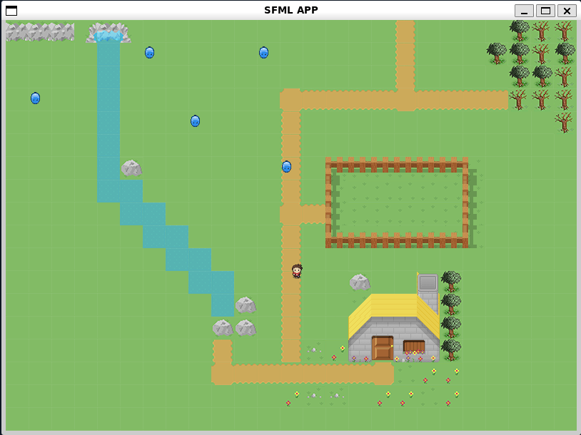

# 2D Game

A 2D game made with the SFML library with tiles.

***

## Prerequisites

- [G++](https://gcc.gnu.org/)
- [SFML](https://www.sfml-dev.org/index.php)
- [Make](https://www.gnu.org/software/make/) (optional)

***

## Compile and Run

``$ make run``

or

``$ g++ src/main.cpp -std=c++2a -lsfml-graphics -lsfml-window -lsfml-system -o 2D_Game``
``$ ./2D_Game``

***

## Usage

- Arrow keys : Move character
- Left click : Sword attack
- Escape : Close game
- Space Bar : Debug mode
